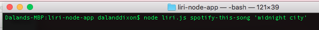
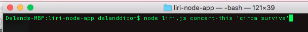
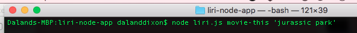
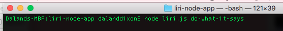
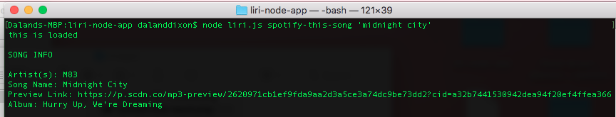
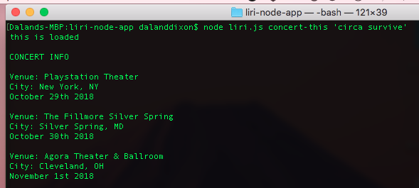
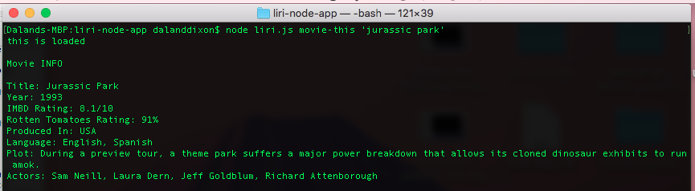
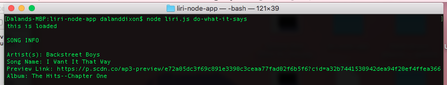

# LIRI

This app was created in order to hone my skills with nodejs and the command line.

To use the app type in the command line 'node liri.js' followed by one of four commands:
* spotify-this-song
  * 
* concert-this
  * 
* movie-this
  * 
* do-what-it-says
  * 

As shown in the images above follow up the first three commands with the song, artist/band, or movie that you would like information on. The last command will take whatever instructions are in the 'random.txt' file and execute them. After pressing the enter key your results should look something like this:
* spotify-this-song
  * 
* concert-this
  * 
* movie-this
  * 
* do-what-it-says
  * 
